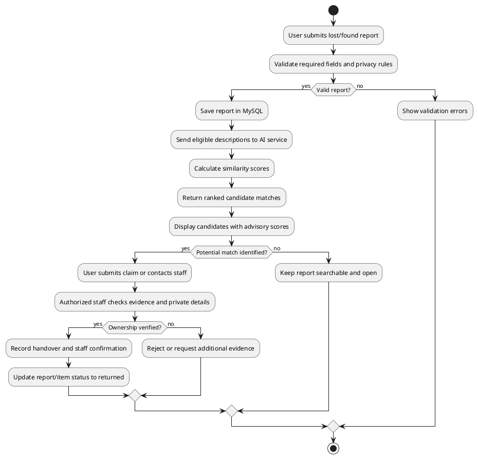

# Activity Diagram — Report, Match, and Recover

```plantuml
@startuml
start
:User submits lost/found report;
:Validate required fields and privacy rules;
if (Valid report?) then (yes)
  :Save report in MySQL;
  :Send eligible descriptions to AI service;
  :Calculate similarity scores;
  :Return ranked candidate matches;
  :Display candidates with advisory scores;
  if (Potential match identified?) then (yes)
    :User submits claim or contacts staff;
    :Authorized staff checks evidence and private details;
    if (Ownership verified?) then (yes)
      :Record handover and staff confirmation;
      :Update report/item status to returned;
    else (no)
      :Reject or request additional evidence;
    endif
  else (no)
    :Keep report searchable and open;
  endif
else (no)
  :Show validation errors;
endif
stop
@enduml
```
