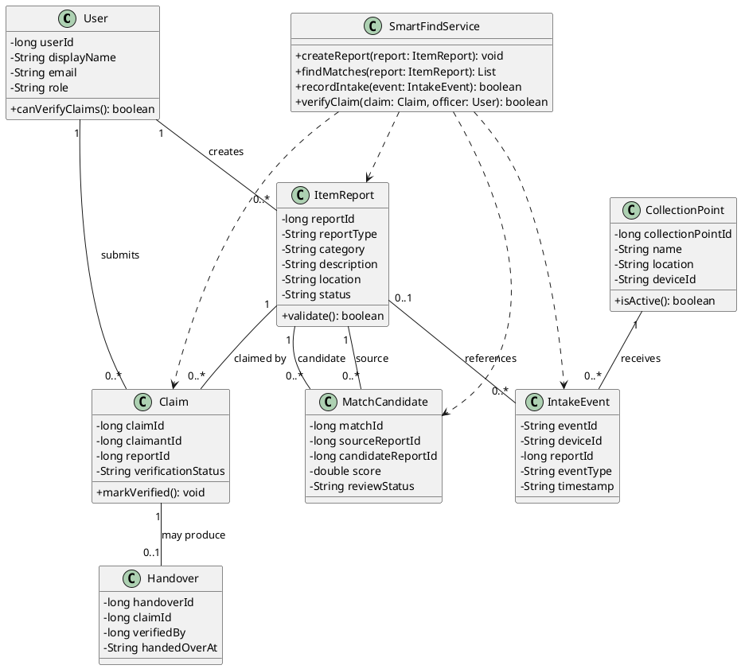

# Class Diagram

```plantuml
@startuml
skinparam classAttributeIconSize 0
class User {
  -long userId
  -String displayName
  -String email
  -String role
  +canVerifyClaims(): boolean
}
class ItemReport {
  -long reportId
  -String reportType
  -String category
  -String description
  -String location
  -String status
  +validate(): boolean
}
class MatchCandidate {
  -long matchId
  -long sourceReportId
  -long candidateReportId
  -double score
  -String reviewStatus
}
class CollectionPoint {
  -long collectionPointId
  -String name
  -String location
  -String deviceId
  +isActive(): boolean
}
class IntakeEvent {
  -String eventId
  -String deviceId
  -long reportId
  -String eventType
  -String timestamp
}
class Claim {
  -long claimId
  -long claimantId
  -long reportId
  -String verificationStatus
  +markVerified(): void
}
class Handover {
  -long handoverId
  -long claimId
  -long verifiedBy
  -String handedOverAt
}
class SmartFindService {
  +createReport(report: ItemReport): void
  +findMatches(report: ItemReport): List
  +recordIntake(event: IntakeEvent): boolean
  +verifyClaim(claim: Claim, officer: User): boolean
}
User "1" -- "0..*" ItemReport : creates
ItemReport "1" -- "0..*" MatchCandidate : source
ItemReport "1" -- "0..*" MatchCandidate : candidate
CollectionPoint "1" -- "0..*" IntakeEvent : receives
ItemReport "0..1" -- "0..*" IntakeEvent : references
User "1" -- "0..*" Claim : submits
ItemReport "1" -- "0..*" Claim : claimed by
Claim "1" -- "0..1" Handover : may produce
SmartFindService ..> ItemReport
SmartFindService ..> MatchCandidate
SmartFindService ..> IntakeEvent
SmartFindService ..> Claim
@enduml
```
