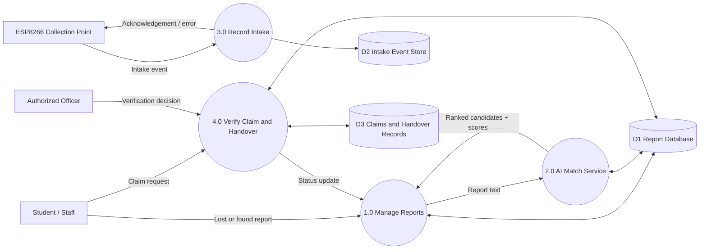

# Data Flow Diagram (DFD)

```mermaid
flowchart LR
    U[Student / Staff] -->|Lost or found report| P1((1.0 Manage Reports))
    P1 <--> D1[(D1 Report Database)]
    P1 -->|Report text| P2((2.0 AI Match Service))
    P2 <--> D1
    P2 -->|Ranked candidates + scores| P1
    ESP[ESP8266 Collection Point] -->|Intake event| P3((3.0 Record Intake))
    P3 --> D2[(D2 Intake Event Store)]
    P3 -->|Acknowledgement / error| ESP
    U -->|Claim request| P4((4.0 Verify Claim and Handover))
    P4 <--> D1
    P4 <--> D3[(D3 Claims and Handover Records)]
    STAFF[Authorized Officer] -->|Verification decision| P4
    P4 -->|Status update| P1
```

**Boundary note:** This is a logical Level-1 DFD. A full deployment should authenticate users and devices and log authorization decisions.
