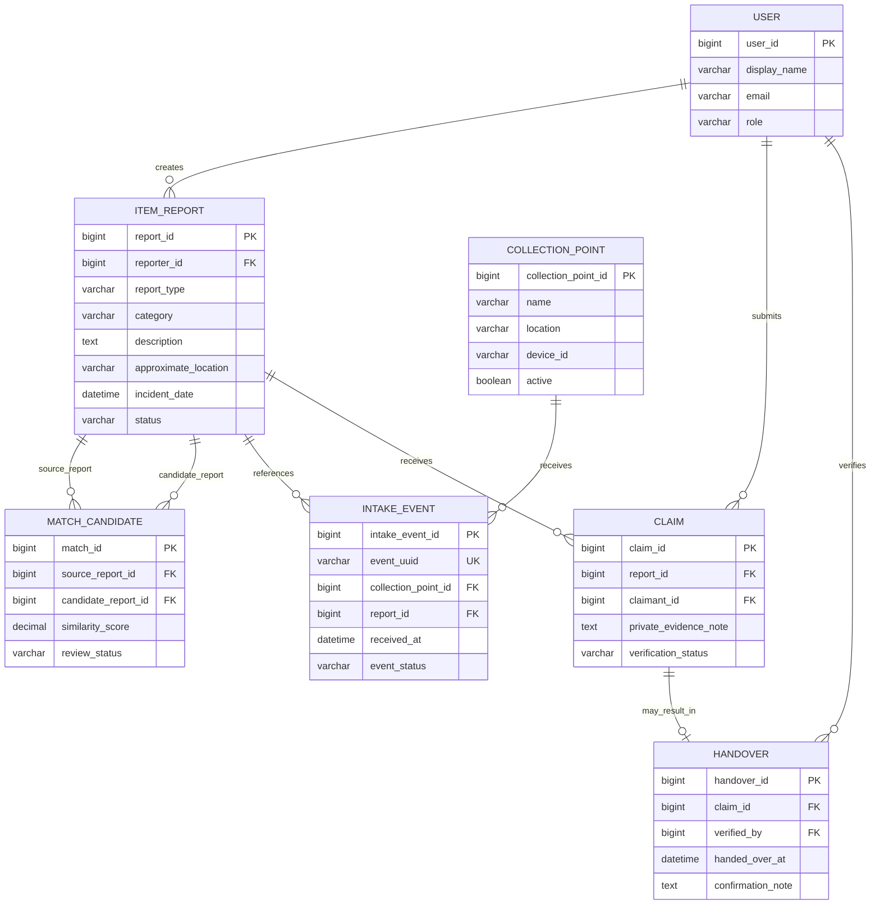

# Entity Relationship Diagram (ERD)

```mermaid
erDiagram
    USER ||--o{ ITEM_REPORT : creates
    ITEM_REPORT ||--o{ MATCH_CANDIDATE : source_report
    ITEM_REPORT ||--o{ MATCH_CANDIDATE : candidate_report
    COLLECTION_POINT ||--o{ INTAKE_EVENT : receives
    ITEM_REPORT ||--o{ INTAKE_EVENT : references
    USER ||--o{ CLAIM : submits
    ITEM_REPORT ||--o{ CLAIM : receives
    CLAIM ||--o| HANDOVER : may_result_in
    USER ||--o{ HANDOVER : verifies
    USER {
      bigint user_id PK
      varchar display_name
      varchar email
      varchar role
    }
    ITEM_REPORT {
      bigint report_id PK
      bigint reporter_id FK
      varchar report_type
      varchar category
      text description
      varchar approximate_location
      datetime incident_date
      varchar status
    }
    MATCH_CANDIDATE {
      bigint match_id PK
      bigint source_report_id FK
      bigint candidate_report_id FK
      decimal similarity_score
      varchar review_status
    }
    COLLECTION_POINT {
      bigint collection_point_id PK
      varchar name
      varchar location
      varchar device_id
      boolean active
    }
    INTAKE_EVENT {
      bigint intake_event_id PK
      varchar event_uuid UK
      bigint collection_point_id FK
      bigint report_id FK
      datetime received_at
      varchar event_status
    }
    CLAIM {
      bigint claim_id PK
      bigint report_id FK
      bigint claimant_id FK
      text private_evidence_note
      varchar verification_status
    }
    HANDOVER {
      bigint handover_id PK
      bigint claim_id FK
      bigint verified_by FK
      datetime handed_over_at
      text confirmation_note
    }
```
