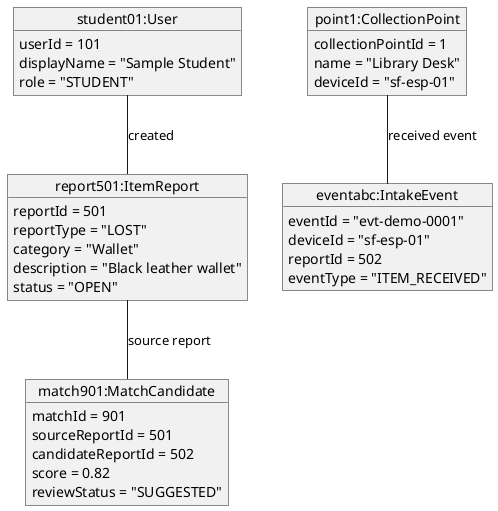

# Object Diagram — Example Runtime Snapshot

```plantuml
@startuml
object "student01:User" as u1 {
  userId = 101
  displayName = "Sample Student"
  role = "STUDENT"
}
object "report501:ItemReport" as r1 {
  reportId = 501
  reportType = "LOST"
  category = "Wallet"
  description = "Black leather wallet"
  status = "OPEN"
}
object "match901:MatchCandidate" as m1 {
  matchId = 901
  sourceReportId = 501
  candidateReportId = 502
  score = 0.82
  reviewStatus = "SUGGESTED"
}
object "point1:CollectionPoint" as cp1 {
  collectionPointId = 1
  name = "Library Desk"
  deviceId = "sf-esp-01"
}
object "eventabc:IntakeEvent" as e1 {
  eventId = "evt-demo-0001"
  deviceId = "sf-esp-01"
  reportId = 502
  eventType = "ITEM_RECEIVED"
}
u1 -- r1 : created
r1 -- m1 : source report
cp1 -- e1 : received event
@enduml
```

All names and records are fictional sample data.
