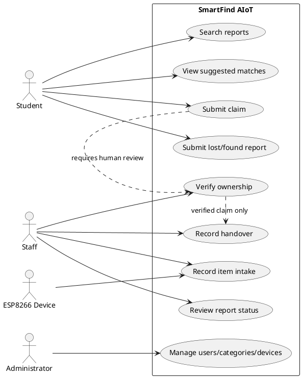

# Use Case Diagram

```plantuml
@startuml
left to right direction
actor Student
actor Staff
actor Administrator
actor "ESP8266 Device" as Device
rectangle "SmartFind AIoT" {
  usecase "Submit lost/found report" as UC1
  usecase "Search reports" as UC2
  usecase "View suggested matches" as UC3
  usecase "Submit claim" as UC4
  usecase "Record item intake" as UC5
  usecase "Verify ownership" as UC6
  usecase "Record handover" as UC7
  usecase "Manage users/categories/devices" as UC8
  usecase "Review report status" as UC9
}
Student --> UC1
Student --> UC2
Student --> UC3
Student --> UC4
Staff --> UC5
Staff --> UC6
Staff --> UC7
Staff --> UC9
Administrator --> UC8
Device --> UC5
UC4 .> UC6 : requires human review
UC6 .> UC7 : verified claim only
@enduml
```
